# Blue-Green Deployment Project Submission
### Zero-Downtime Web Tier Deployment on AWS

**Name:** Penina Wanyama
**Date:** 14/072026
**AWS Region used:** us-east-2(ohio)

---

## Overview

This document records my implementation of a blue-green deployment on AWS, including
the architecture I built, how I validated the new (Green) environment before exposing
it to traffic, the monitoring I configured, and the automated rollback mechanism I
tested. Screenshot evidence for each step is embedded below.

---

## Section 1: Blue Environment (Live Site)

### 1.1 Security Group (`web-tier-sg`)

Firewall rules created to allow HTTP, HTTPS, and SSH (restricted to my IP).

- Security Group ID: `sg-0f2565a7bfa947882`

**Screenshot evidence:**

> Security Group inbound rules showing HTTP/HTTPS/SSH_
>
> 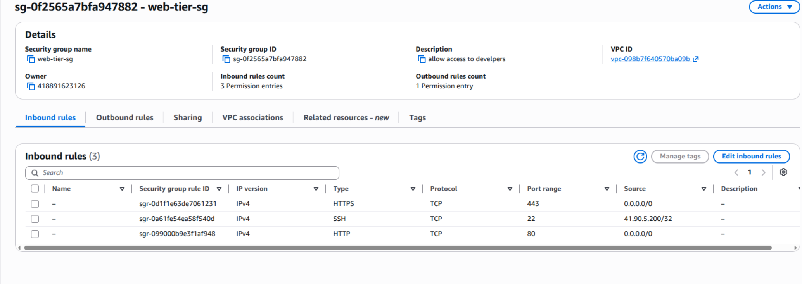

---

### 1.2 Blue EC2 Instances (`web-blue-1`, `web-blue-2`)

Two Ubuntu 26.04 instances launched with Apache installed via user data, serving
"Blue environment - v1.0".

**Screenshot evidence:**

>EC2 Instances list showing both Blue instances in "Running" state
> with 2/2 status checks passed_
>
> 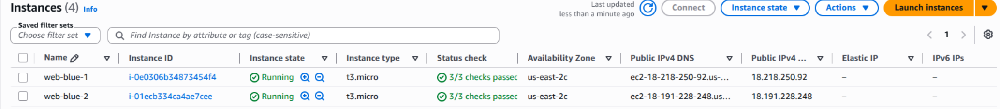

---

### 1.3 Blue Target Group (`tg-blue`)

Target group created on port 80, with both Blue instances registered.

**Screenshot evidence:**

> tg-blue Targets tab showing both instances registered
>
> 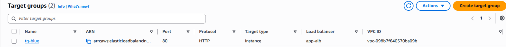

---

### 1.4 Load Balancer (`app-alb`)

Application Load Balancer created, spanning 2+ Availability Zones, default listener
forwarding to `tg-blue`.

- ALB DNS name: `app-alb-1960157759.us-east-2.elb.amazonaws.com`

**Screenshot evidence:**

> Load balancer "Active" state and DNS name
>
> 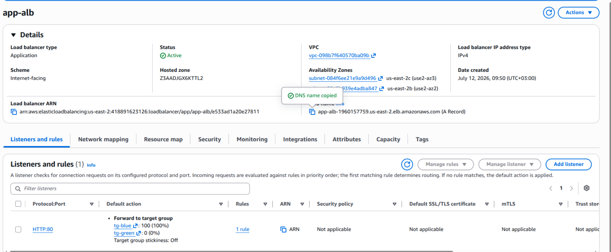

> Browser showing "Blue environment - v1.0" when visiting the ALB DNS name
>
> 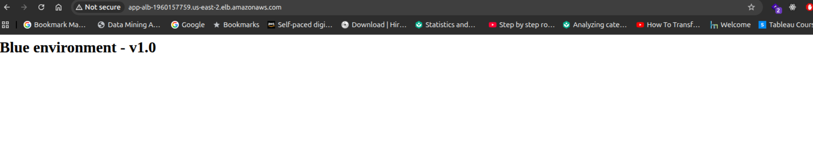

---

## Section 2: Green Environment (New Version, Deployed Privately)

### 2.1 Green Target Group (`tg-green`)

Created identically to `tg-blue`, no instances registered yet at this stage.

**Screenshot evidence:**

> tg-green created, empty target list
>
> 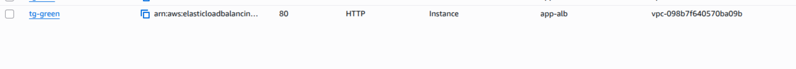

---

### 2.2 Green EC2 Instances (`web-green-1`, `web-green-2`)

Same AMI, security group, and subnet as Blue, but serving "Green environment - v2.0".
Registered to `tg-green`. Not yet attached to the ALB listener.

**Screenshot evidence:**

> Green instances running
>
> 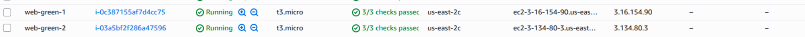

> tg-green Targets tab with both Green instances registered
>
> 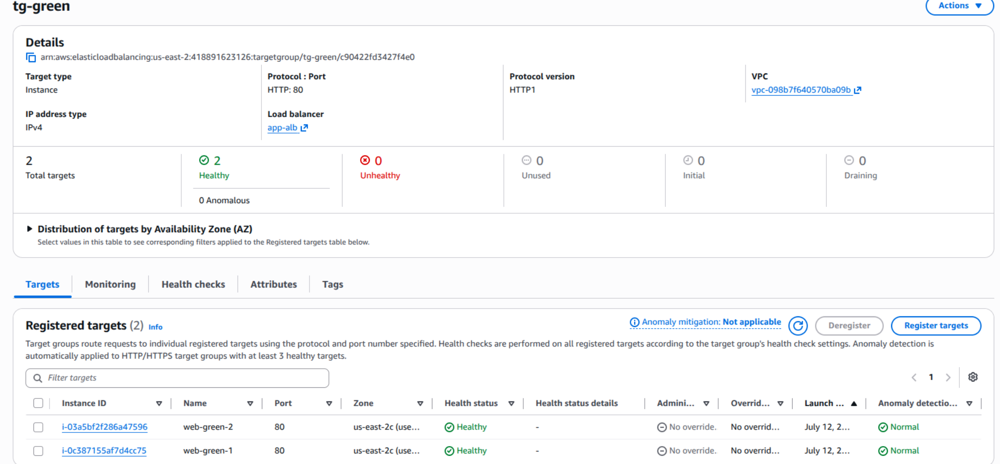

---

### 2.3 Private Validation (Smoke Test)

Confirmed each Green instance serves the new version directly via its public IP,
before any traffic switch.

**Screenshot evidence:**

> Browser showing "Green environment - v2.0" via web-green-1's public IP
>
> 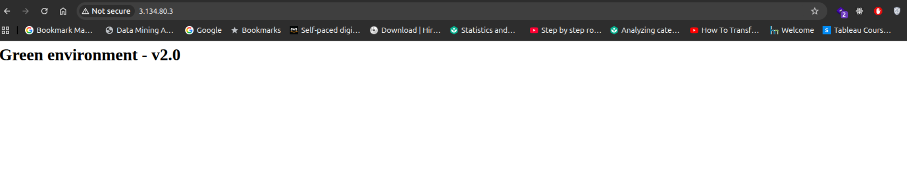

> Browser showing "Green environment - v2.0" via web-green-2's public IP
>
> 

---

## Section 3: Green Health Checks

Health check settings configured on `tg-green` (path `/`, healthy threshold 3,
unhealthy threshold 2, timeout 5s, interval 15s, success code 200). Confirmed both
Green targets reach **Healthy** status before proceeding.

**Screenshot evidence:**

> tg-green Health checks configuration
>
> 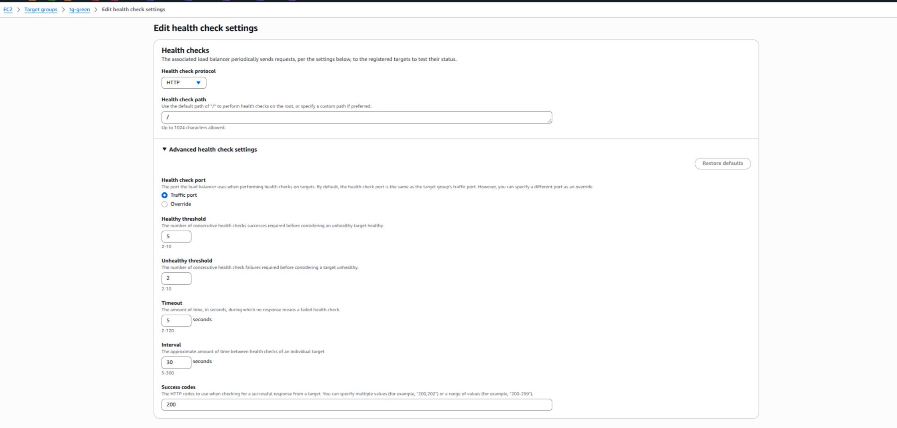

> tg-green Targets tab showing both instances as "Healthy"
>
> 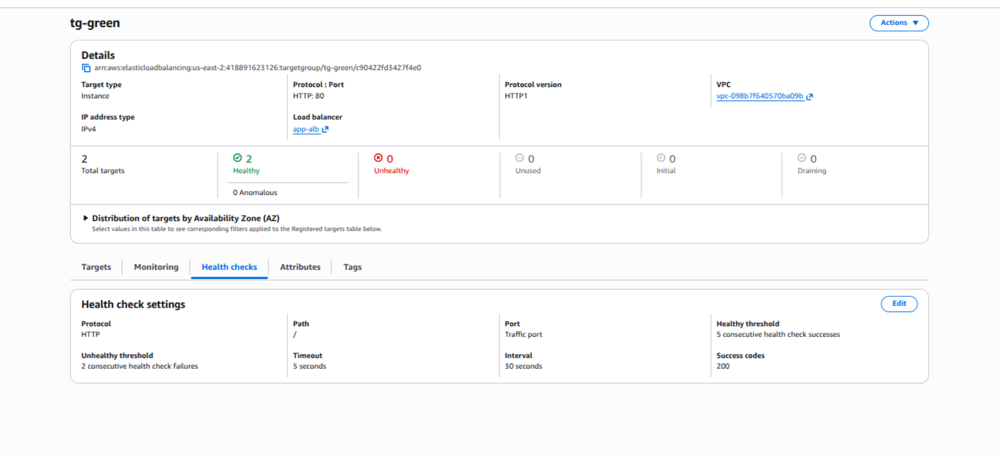

---

## Section 4: Traffic Cutover

**Method used:** Gradual (weighted)

### Gradual weighted switch (if used)

Traffic shifted incrementally (e.g. 90/10 → 70/30 → 50/50 → 20/80 → 0/100) between
`tg-blue` and `tg-green`, either manually or via `switch_traffic.py`.

**Screenshot evidence:**

> Listener rule showing weighted forwarding between tg-blue/tg-green
>
> 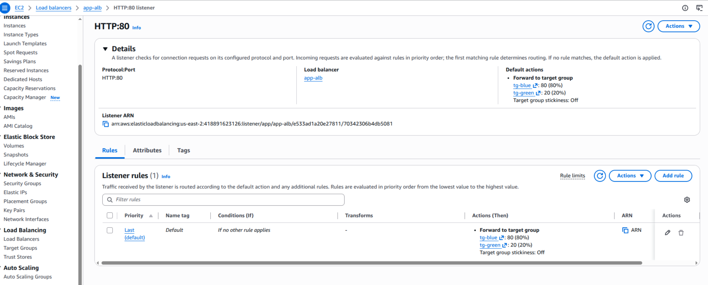

---

### 4.1 Monitoring During Cutover

Three CloudWatch alarms created against `tg-green`:

| Alarm name | Metric | Threshold |
|---|---|---|
| `Green-5xx-High` | `HTTPCode_Target_5XX_Count` | > 5 in 1 min |
| `Green-ResponseTime-High` | `TargetResponseTime` | avg > 1s over 5 min |
| `Green-UnhealthyHosts` | `UnHealthyHostCount` | ≥ 1 for 2 consecutive checks |

SNS notification email configured: `deployment-alerts`

**Screenshot evidence:**

> CloudWatch Alarms list showing all three alarms in "OK" state
>
> 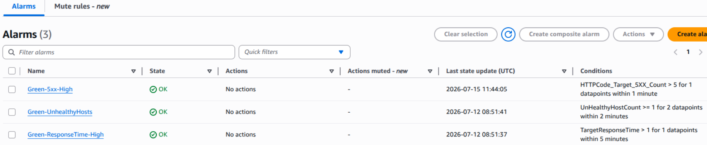

> One alarm's detail page showing metric graph and threshold
>
> 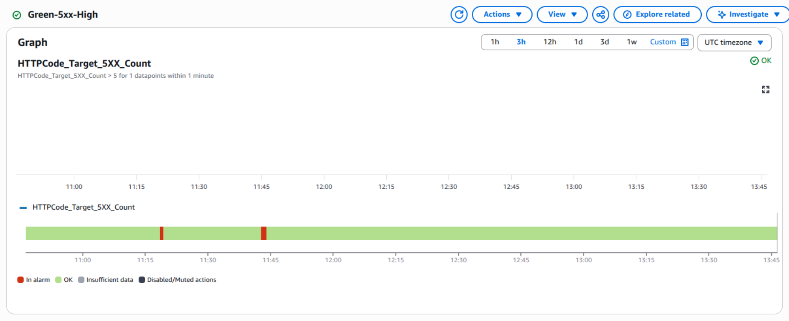

---

## Section 5: Automated Rollback

### 5.1 Lambda Function (`rollback-to-blue`)

Python 3.14 Lambda that resets listener weights to Blue: 100 / Green: 0 when invoked.
IAM role attached with ELB modify permissions.

**Screenshot evidence:**

> Lambda function code editor showing deployed rollback code
>
> 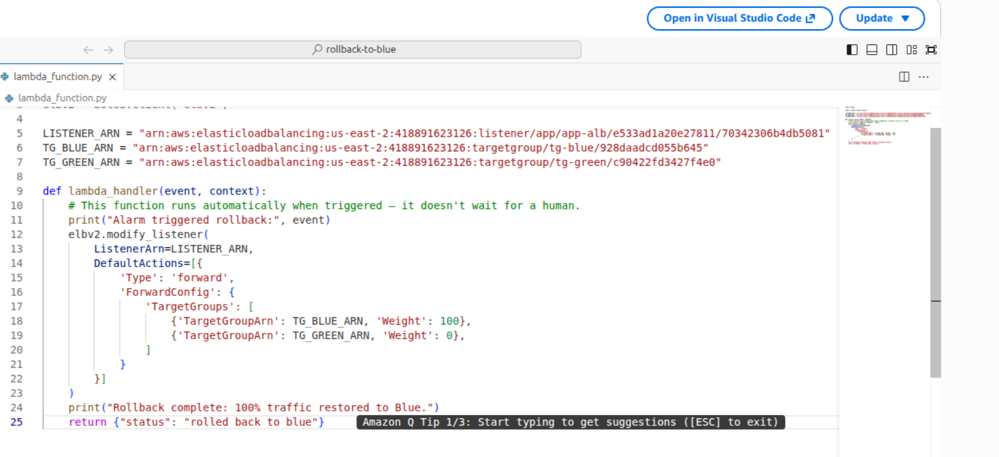

---

### 5.2 EventBridge Rule (`trigger-rollback-on-alarm`)

Event pattern matching CloudWatch alarm state changes to `ALARM` for the three
Green alarms, targeting the `rollback-to-blue` Lambda.

**Screenshot evidence:**

> EventBridge rule event pattern configuration
>
> 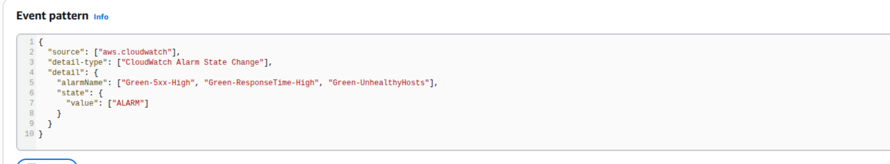

> _Insert screenshot: EventBridge rule Target set to rollback-to-blue Lambda_
>
> 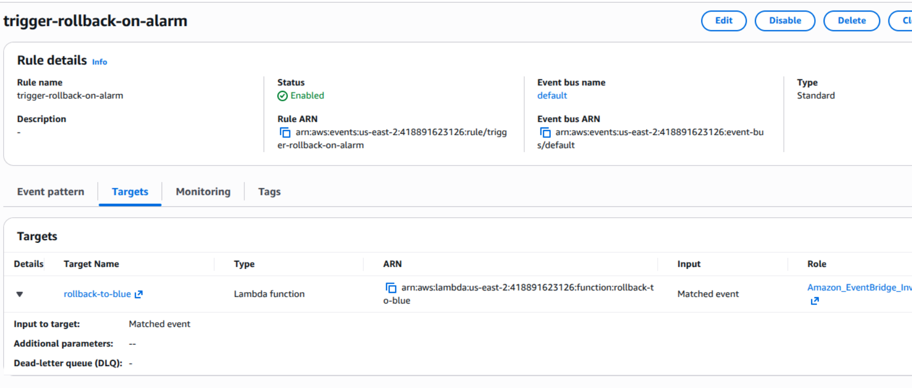

---

### 5.3 Rollback Test

Manually forced an alarm into `ALARM` state via AWS CLI to trigger the full chain
(Alarm → EventBridge → Lambda → listener weights reset).

**Screenshot evidence:**

> 
> 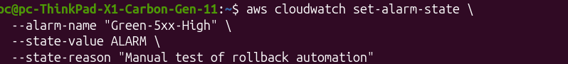

> Lambda CloudWatch log stream showing "Rollback complete: 100% traffic restored to Blue."_
>
> 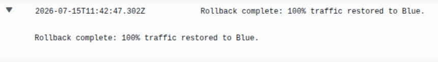

> ALB Listener showing weights reset to Blue: 100, Green: 0
>
> 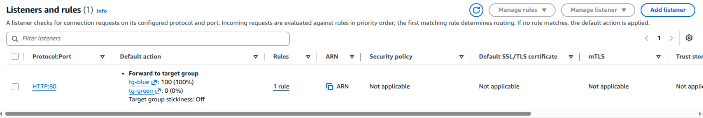

---

## Appendix: Resource Reference

| Resource | Name / ID |
|---|---|
| Security Group | `web-tier-sg` | 
| Blue instances | `web-blue-1`, `web-blue-2` | 
| Green instances | `web-green-1`, `web-green-2` | 
| Target Group (Blue) | `tg-blue` | 
| Target Group (Green) | `tg-green` | 
| Load Balancer | `app-alb` | 
| Listener | HTTP:80 | |
| Lambda | `rollback-to-blue` | 
| EventBridge Rule | `trigger-rollback-on-alarm` | 
| SNS Topic |`deployment-alerts` | 
